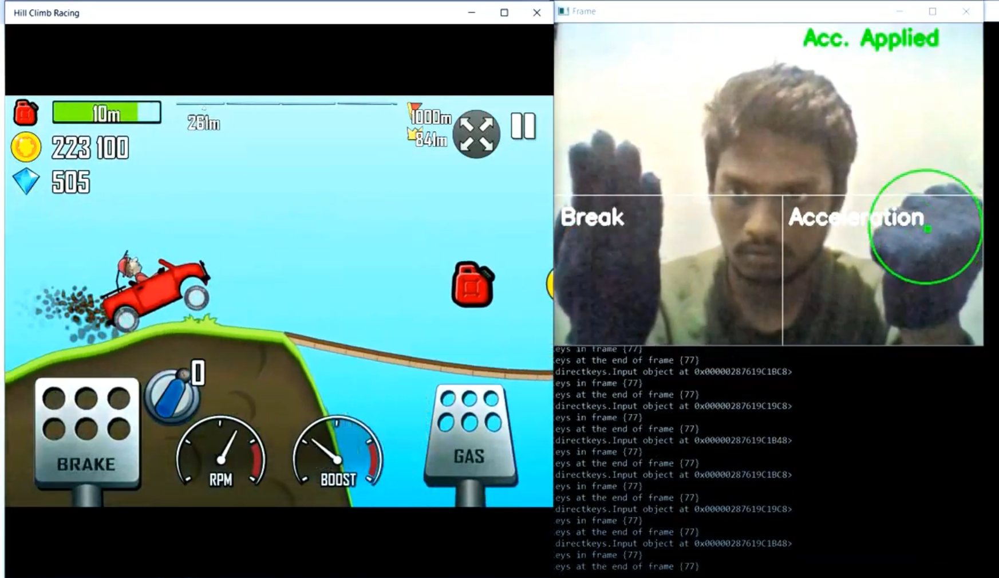

# Gesture Gaming using OpenCV
Hand gestures are super cool to use instead of keyboard keys! 
So, I have used my Hand Gestures to play Hill Climb Racing game with the help of OpenCV library in Python.
## Controls
- Right Hand Fist- Acceleration
- Left Hand Fist- Break

## Requirements
- python 3.x
- imutils
- numpy
- opencv-python

## Description
Using OpenCV, the screen is divided in such a way that the bottom left region of the screeen is used for applying breaks, whereas bottom right region of the screen is used for acceleration.
 

When a navy blue circle(fists in navy blue gloves) is detected in any of the regions, corresponding key is given as input to the game from our program.

<b>NOTE</b>: No machine learning model is used for detecting objects!!
 <b>Let's take a ride then!</b>

   
Further, you can play your favourite games and add more controls based on your requirements.
 Here is the <a href="https://www.youtube.com/watch?v=MoPcUaXdA20&feature=youtu.be">link</a> to the YouTube video of my Hill Climb Racing gamplay using hand gestures.  
